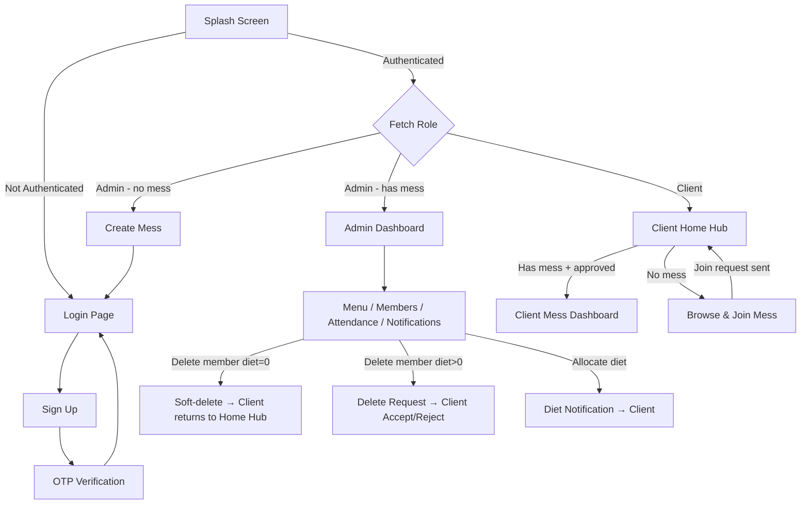

# 🍽️ Smart Mess App

A **multi-tenant mess (dining hall) management system** built with **Flutter** and **Firebase**. The app streamlines daily operations for both mess administrators and members — from menu planning and attendance tracking to availability management, diet balance monitoring, and member approvals.

> **Platform:** Flutter (Dart) + Firebase (Auth, Cloud Firestore, Cloud Functions)

---

## ✨ Features

### 🔐 Authentication (Firebase Phone + OTP)
- Phone number authentication with OTP verification
- Role-based access control — **Admin** & **Client**
- Auto-login via splash screen with role-based routing
- **Firebase App Check** integrated (Play Integrity & Debug Provider)
- New clients can skip mess selection during signup and join later
- Server-side signup & OTP rate-limiting via **Cloud Functions**
- **Enhanced Local Testing:** Auth debug settings enabled for seamless OTP testing manually.

### 👨‍💼 Admin Panel

| Page | Feature | Description |
|------|---------|-------------|
| **Admin Home Hub** | Mess Selection | Centralized hub to manage up to **3 distinct messes** per admin |
| **Dashboard** | Quick Actions | Access to menu, availability, members, attendance & notifications. Admins can also update mess names here. |
| **Menu Management** | Weekly Templates | Set/update a recurring **7-day weekly menu template** (Mon–Sun) |
| **Availability List** | Meal Tracking | View available clients for each meal; generate attendance records |
| **Members Panel** | Member Mgmt | View all members, approve/remove, manage diet balances |
| **Client Detail** | Diet Allocation | Allocate diets to individual members (sends notification) |
| **Notifications** | Request Handling | Process approval & delete requests |
| **Attendance** | Record Keeping | Record & view meal attendance logs |

### 👤 Client Panel

| Page | Feature | Description |
|------|---------|-------------|
| **Home Hub** | Central Landing | Shows joined mess, available messes to join, profile & notifications |
| **Mess Dashboard** | Mess View | Diet counter, today's dynamic menu, "View Full Week" animated bottom sheet |
| **Availability** | Meal Toggles | Toggle ON/OFF for meals, plus new **Specific Meal Permanent Off** checkboxes (Morning/Evening) |
| **Notifications** | Activity Feed | Diet allocation alerts, removal requests (accept/reject), status updates |
| **Profile** | Account Mgmt | View profile, change password, change phone number, logout |

### 🏠 Mess Management
- **Create a Mess** — Admins create a new mess group
- **Join a Mess** — Clients browse messes from the Home Hub and send join requests
- **Soft Removal** — Admin removal clears mess association; client retains account and can rejoin

---

## 🎨 Design System — "Midnight Feast" Theme

The entire UI follows a custom dark theme called **"Midnight Feast"**, featuring:

### Color Palette
| Token | Hex | Usage |
|-------|-----|-------|
| Scaffold Dark | `#0F0F1A` | Primary background |
| Surface Dark | `#1A1A2E` | Card / panel backgrounds |
| Surface Light | `#252540` | Input fields / elevated surfaces |
| Accent Orange | `#FF6B35` | Primary actions, buttons, CTA |
| Accent Teal | `#00D9A6` | Success states, secondary actions |
| Accent Rose | `#FF4D6D` | Errors, danger states |
| Accent Amber | `#FFB347` | Warnings |
| Accent Blue | `#4DA8FF` | Informational states |

### Design Principles
- **Glassmorphism** — Frosted-glass cards with `BackdropFilter` blur, translucent backgrounds, and subtle borders
- **Gradient Accents** — Multi-color gradient buttons and icon containers (Orange→Rose, Teal→Cyan, Blue→Violet, Amber→Orange)
- **Micro-Animations** — Staggered list entrance animations, press-scale feedback on cards, shimmer loading placeholders, and smooth page transitions (fade + slide)
- **Modern Typography** — `Poppins` for headings, `Inter` for body text (via Google Fonts)
- **Consistent Spacing** — 20px card padding, 16px border radius on inputs, 20px border radius on cards

### Shared Widget Library

| Widget | Description |
|--------|-------------|
| `GlassCard` | Frosted-glass container with backdrop blur, press-scale animation, and configurable border/background |
| `GradientScaffold` | Full-screen scaffold wrapped in the `scaffoldGradient` for consistent backgrounds |
| `AnimatedListItem` | Staggered fade-in + slide-up entrance animation for list items |
| `ShimmerLoading` | Pulsing shimmer placeholder during data loading |
| `StatusBadge` | Colored pill badge with icon for status indicators (success/warning/danger/info) |
| `CustomButton` | Gradient button with loading state, icon support, and glow shadow |
| `CustomTextField` | Themed text input with icon prefix, validation, and focus animations |

---

## 📸 App Screenshots

### 🔑 General (Auth & Profile)

<table>
  <tr>
    <td align="center"><br/><b>Splash Screen</b></td>
    <td align="center"><br/><b>Login</b></td>
    <td align="center"><br/><b>Sign Up</b></td>
    <td align="center"><br/><b>Profile</b></td>
  </tr>
  <tr>
    <td align="center"><br/><b>Update Name</b></td>
    <td align="center"><br/><b>Update Password</b></td>
    <td align="center"><br/><b>Update Phone</b></td>
    <td></td>
  </tr>
</table>

### 👨‍💼 Admin Panel

<table>
  <tr>
    <td align="center"><br/><b>Admin Home Hub</b></td>
    <td align="center"><br/><b>Dashboard</b></td>
    <td align="center"><br/><b>Menu Management</b></td>
    <td align="center"><br/><b>Mess Name Update</b></td>
  </tr>
  <tr>
    <td align="center"><br/><b>Members</b></td>
    <td align="center"><br/><b>Pending Requests</b></td>
    <td align="center"><br/><b>Diet Allocation</b></td>
    <td align="center"><br/><b>Notifications</b></td>
  </tr>
  <tr>
    <td align="center"><br/><b>Attendance</b></td>
    <td align="center"><br/><b>Attendance Records</b></td>
    <td align="center"><br/><b>Availability List</b></td>
    <td align="center"><br/><b>Availability Details</b></td>
  </tr>
</table>

### 👤 Client Panel

<table>
  <tr>
    <td align="center"><br/><b>Home Hub</b></td>
    <td align="center"><br/><b>Mess Dashboard</b></td>
    <td align="center"><br/><b>Weekly Menu</b></td>
    <td align="center"><br/><b>Notifications</b></td>
  </tr>
  <tr>
    <td align="center"><br/><b>Availability Status</b></td>
    <td align="center"><br/><b>Recurring Meal-Off</b></td>
    <td align="center"><br/><b>Permanent Off</b></td>
    <td></td>
  </tr>
</table>

---

## 🏗️ Project Structure

```
smart_mess_app/
│
├── android/                          # Android platform files
├── ios/                              # iOS platform files
├── web/ | macos/ | windows/ | linux/ # Other platform targets
│
├── assets/
│   ├── icons/
│   │   └── Mess_icon.png            # App icon asset
│   └── UI_visuals/                  # App screenshots for README
│
├── functions/
│   └── index.js                     # Firebase Cloud Functions
│       ├── processDietDeductions    #   Scheduled diet deduction (every 30 min)
│       ├── createUserProfile        #   Server-side signup with rate limiting
│       └── reserveOtpRequest        #   OTP rate limiting per device
│
├── firestore.rules                  # Firestore security rules
├── firestore.indexes.json           # Composite index definitions
├── firebase.json                    # Firebase project configuration
│
├── lib/
│   ├── main.dart                     # App entry point (Firebase init)
│   ├── app.dart                      # MaterialApp configuration (dark theme)
│   │
│   ├── core/
│   │   ├── constants/
│   │   │   ├── app_colors.dart       # "Midnight Feast" color palette + gradients
│   │   │   ├── app_decorations.dart  # Glass, gradient & accent box decorations
│   │   │   ├── app_text_styles.dart  # Typography tokens (Poppins + Inter)
│   │   │   ├── app_strings.dart      # Static strings
│   │   │   └── enums.dart            # UserRole, MealType, NotificationType, etc.
│   │   │
│   │   ├── theme/
│   │   │   └── app_theme.dart        # Full Material 3 dark theme definition
│   │   │
│   │   ├── utils/
│   │   │   ├── validators.dart       # Input validation
│   │   │   └── date_utils.dart       # Date formatting & comparison helpers
│   │   │
│   │   ├── services/
│   │   │   ├── auth_service.dart          # Phone auth + OTP + password linking
│   │   │   ├── firestore_service.dart     # Firestore CRUD + streams
│   │   │   ├── notification_service.dart  # Create notifications in Firestore
│   │   │   ├── diet_deduction_service.dart # Client-side diet deduction logic
│   │   │   └── device_id_service.dart     # Persistent device ID for rate limiting
│   │   │
│   │   └── routes/
│   │       └── app_routes.dart        # Route constants + animated route generator
│   │
│   ├── models/
│   │   ├── mess_model.dart            # Mess group data
│   │   ├── user_model.dart            # User profile + role + mess info
│   │   ├── diet_balance_model.dart    # Total & remaining diets
│   │   ├── availability_model.dart    # Per-meal availability status
│   │   ├── attendance_model.dart      # Attendance record
│   │   └── notification_model.dart    # Notification with type, status, message
│   │
│   ├── repositories/                  # Data access layer (abstract interfaces)
│   │   ├── auth_repository.dart
│   │   ├── user_repository.dart
│   │   ├── mess_repository.dart
│   │   ├── diet_repository.dart
│   │   ├── menu_repository.dart
│   │   ├── availability_repository.dart
│   │   ├── attendance_repository.dart
│   │   └── notification_repository.dart
│   │
│   └── features/
│       ├── auth/
│       │   ├── splash/               # Splash → auto-route by role
│       │   ├── login/                # Phone login (controller + screen)
│       │   ├── signup/               # Registration + OTP
│       │   ├── otp/                  # OTP verification screen
│       │   ├── create_mess/          # Admin: create new mess
│       │   └── select_mess/          # Legacy: join mess (now via Home Hub)
│       │
│       ├── client/
│       │   ├── home/                 # ★ Home Hub — central landing page
│       │   ├── dashboard/            # Mess-specific: diet counter, menu, status
│       │   ├── availability/         # Meal availability toggles + calendar
│       │   ├── notifications/        # Notification feed with actions
│       │   └── profile/              # Profile, change password, change phone
│       │
│       ├── admin/
│       │   ├── home/                 # ★ Admin Home Hub (manage multiple messes)
│       │   ├── dashboard/            # Admin dashboard with quick action cards
│       │   ├── menu/                 # Set weekly menus (controller + screen)
│       │   ├── availability_list/    # View available members per meal
│       │   ├── attendance/           # Record & view attendance
│       │   ├── members/              # Member list + client detail + diet allocation
│       │   └── notifications/        # Process approval/delete requests
│       │
│       └── shared_widgets/
│           ├── glass_card.dart        # Glassmorphism card with blur + press feedback
│           ├── gradient_scaffold.dart # Gradient-wrapped scaffold
│           ├── animated_list_item.dart # Staggered list entrance animation
│           ├── shimmer_loading.dart   # Shimmer loading placeholder
│           ├── status_badge.dart      # Colored status pill badge
│           ├── custom_button.dart     # Gradient button with loading state
│           └── custom_text_field.dart # Themed input with validation
│
├── pubspec.yaml                      # Dependencies
└── README.md
```

---

## 🛠️ Tech Stack

| Layer | Technology |
|-------|------------|
| **Framework** | Flutter (Dart SDK ^3.10.8, Material 3) |
| **Backend** | Firebase (Auth + Cloud Firestore + Cloud Functions v2) |
| **Security** | **Firebase App Check** (Play Integrity + Debug Provider) |
| **Auth** | Firebase Phone Authentication (OTP) |
| **State Management** | Provider |
| **Serverless** | Firebase Cloud Functions (Node.js) — diet deduction, signup & OTP rate-limiting |
| **Typography** | Google Fonts (Poppins + Inter) |
| **Animations** | flutter_animate (shimmer, staggered lists, micro-interactions) |
| **Calendar** | table_calendar |
| **Local Storage** | shared_preferences |
| **Utilities** | intl (date formatting), uuid (device ID generation) |

---

## ☁️ Cloud Functions

The `functions/` directory contains **Firebase Cloud Functions v2** deployed to `asia-south1`:

| Function | Trigger | Description |
|----------|---------|-------------|
| `processDietDeductions` | Scheduled (every 30 min) | Processes meal-time diet deductions for all approved clients. Uses Firestore transactions and idempotent deduction markers (`dietDeductionRuns`) to prevent double-processing. |
| `createUserProfile` | Callable (onCall) | Server-side signup — validates auth, checks for duplicate accounts, enforces hourly signup rate limit (20/hour), and creates the user document. |
| `reserveOtpRequest` | Callable (onCall) | OTP rate limiting — tracks OTP requests per device ID (2/hour max) to prevent abuse. |

### Deduction Marker Collection: `dietDeductionRuns/{uid_date_meal}`
| Field | Type | Description |
|-------|------|-------------|
| `uid` | string | User reference |
| `messId` | string | Mess reference |
| `date` | string | `YYYY-MM-DD` |
| `meal` | string | `MORNING` \| `EVENING` |
| `deducted` | boolean | Whether a diet was actually deducted |
| `skippedReason` | string (optional) | Why deduction was skipped (e.g. `user_off`, `availability_off`, `no_remaining_diets`) |
| `processedAt` | timestamp | Processing time |

### OTP Tracking Collection: `otpRequests/{autoId}`
| Field | Type | Description |
|-------|------|-------------|
| `deviceId` | string | UUID generated per device |
| `phoneNumber` | string | Requesting phone number |
| `createdAt` | timestamp | Request time |

---

## 🗄️ Firestore Data Model

All data is scoped by `messId` to ensure multi-tenant isolation.

### `messes/{messId}`
| Field | Type | Description |
|-------|------|-------------|
| `messName` | string | Unique name per admin |
| `createdBy` | uid | Admin who created it |
| `createdAt` | timestamp | Creation time |

### `users/{uid}`
| Field | Type | Description |
|-------|------|-------------|
| `name` | string | Display name |
| `contactNumber` | string | Phone number |
| `role` | `"ADMIN"` \| `"CLIENT"` | User role |
| `messId` | string \| null | Associated mess (null if not joined) |
| `approved` | boolean | Admin approval status |
| `permanentOff` | boolean | Permanently opt out of meals |
| `morningOff` | boolean | Morning meal opt-out |
| `eveningOff` | boolean | Evening meal opt-out |
| `createdAt` | timestamp | Registration time |

### `dietBalances/{uid}`
| Field | Type | Description |
|-------|------|-------------|
| `totalDiets` | number | Total allocated diets |
| `remainingDiets` | number | Remaining (never < 0) |
| `lastUpdated` | timestamp | Last modification time |

### `weekly_menus/{messId}`
| Field | Type | Description |
|-------|------|-------------|
| `1` to `7` | Map | Weekday maps (1=Mon, 7=Sun). Example: `{"morning": "...", "evening": "..."}` |
| `updatedBy` | uid | Admin who last updated |
| `updatedAt` | timestamp | Update time |

### `availability/{uid_date_meal}`
| Field | Type | Description |
|-------|------|-------------|
| `uid` | string | User reference |
| `messId` | string | Mess reference |
| `date` | string | `YYYY-MM-DD` |
| `meal` | `"MORNING"` \| `"EVENING"` | Meal type |
| `status` | `"ON"` \| `"OFF"` | Availability |
| `locked` | boolean | Past cutoff = locked |

### `notifications/{notificationId}`
| Field | Type | Description |
|-------|------|-------------|
| `messId` | string | Mess reference |
| `type` | `"APPROVAL_REQUEST"` \| `"DELETE_REQUEST"` \| `"DIET_ALLOCATED"` \| `"ACCOUNT_DELETED"` | Notification type |
| `fromUid` / `toUid` | uid | Sender / receiver |
| `status` | `"PENDING"` \| `"ACCEPTED"` \| `"REJECTED"` | Current status |
| `message` | string (optional) | Human-readable detail (e.g. "30 diets added") |
| `createdAt` | timestamp | Request time |

### `attendance/{messId_date_meal}` + subcollection `records/{uid}`
| Field | Type | Description |
|-------|------|-------------|
| `messId` | string | Mess reference |
| `date` | string | `YYYY-MM-DD` |
| `meal` | string | Meal type |
| `records/{uid}.present` | boolean | Attendance status |

> 📌 **Retention rule:** Only the latest **3 attendance documents** per mess are retained.

### 🔗 Firestore Composite Indexes Required

| Collection | Fields | Order |
|------------|--------|-------|
| `notifications` | `toUid` (Asc) + `createdAt` (Desc) | Client notifications query |
| `notifications` | `toUid` (Asc) + `status` (Asc) + `createdAt` (Desc) | Admin notifications query |

> Create these indexes via the Firebase Console or by clicking the link in the debug console error. Index definitions are also available in `firestore.indexes.json`.

---

## 🔄 User Flow

### Signup & Login
```
Signup → OTP Verification → Login Page
Login → Splash → Route by Role
├── Admin (no mess)  → Create Mess → Login
├── Admin (has mess)  → Admin Dashboard
└── Client (any)      → Client Home Hub
```

### Client Home Hub (Central Landing)
```
Client Home Hub
├── Has Mess + Approved  → Tap to open Mess Dashboard
├── Has Mess + Pending   → Shows "Waiting for approval"
├── No Mess              → Browse & join from available list
├── Notifications icon   → Notification feed
└── Profile icon         → Profile management
```

### Notification Types

| Type | Trigger | Displayed To | Actions |
|------|---------|-------------|---------|
| `APPROVAL_REQUEST` | Client joins mess | Admin | Approve / Reject |
| `DIET_ALLOCATED` | Admin adds diets | Client | Informational (shows amount) |
| `DELETE_REQUEST` | Admin removes client (diet > 0) | Client | Accept / Reject |
| `ACCOUNT_DELETED` | Admin removes client (diet = 0) | Client | Informational |

### Member Removal Flow
```
Admin clicks Delete
├── Client has 0 remaining diets
│   ├── Send ACCOUNT_DELETED notification
│   ├── Clear messId & approved (soft-delete)
│   └── Delete dietBalances
│
└── Client has remaining diets > 0
    ├── Send DELETE_REQUEST notification
    └── Client decides:
        ├── Accept → Clear messId, delete dietBalances → Home Hub
        └── Reject → Stay in mess
```

### Full Flow Diagram



---

## 🍽️ Diet Deduction Logic
For each meal, a diet is deducted if **all** conditions are met:
- `permanentOff == false`
- `mealOff == false` (morningOff / eveningOff)
- `availability.status != "OFF"`
- `remainingDiets > 0`

> ⚡ Deductions are processed **server-side** via the `processDietDeductions` Cloud Function (runs every 30 minutes). Each deduction is tracked with an idempotent marker document in `dietDeductionRuns` to guarantee exactly-once processing.

### ⏰ Time Restrictions
| Meal | Cutoff | After Cutoff |
|------|--------|--------------|
| Morning | **7:00 AM** | Locked (no toggle) |
| Evening | **3:00 PM** | Locked (no toggle) |

---

## 🚀 Getting Started

### Prerequisites
- [Flutter SDK](https://docs.flutter.dev/get-started/install) (>= 3.10.8)
- [Firebase CLI](https://firebase.google.com/docs/cli)
- [Node.js](https://nodejs.org/) (>= 18, for Cloud Functions)
- A Firebase project with **Phone Auth**, **Cloud Firestore**, and **Cloud Functions** enabled

### Setup

1. **Clone the repository**
   ```bash
   git clone https://github.com/osctoss/smart_mess_app.git
   cd smart_mess_app
   ```

2. **Configure Firebase**
   ```bash
   dart pub global activate flutterfire_cli
   flutterfire configure
   ```
   - Enable **Phone Authentication** in Firebase Console
   - Enable **Cloud Firestore** in Firebase Console
   - Place `google-services.json` in `android/app/`
   - Place `GoogleService-Info.plist` in `ios/Runner/`

3. **Install Flutter dependencies**
   ```bash
   flutter pub get
   ```

4. **Install & deploy Cloud Functions**
   ```bash
   cd functions
   npm install
   firebase deploy --only functions
   ```

5. **Create Firestore composite indexes** (see [Indexes Required](#-firestore-composite-indexes-required) section)
   ```bash
   firebase deploy --only firestore:indexes
   ```

6. **Deploy Firestore security rules**
   ```bash
   firebase deploy --only firestore:rules
   ```

7. **Run the app**
   ```bash
   flutter run
   ```

---

## 🔒 Security

### Firestore Rules
- All reads/writes are filtered by `messId`
- Clients cannot access data from other messes
- **Only Admin** can modify: weekly_menus, dietBalances, approvals, attendance
- **Only Client** can modify: their own availability & profile
- Notifications are scoped to sender (`fromUid`) and receiver (`toUid`)

### Gitignored Sensitive Files
| File | Reason |
|------|--------|
| `lib/firebase_options.dart` | Firebase API keys |
| `android/app/google-services.json` | Android Firebase config |
| `ios/Runner/GoogleService-Info.plist` | iOS Firebase config |
| `.env` / `.env.*` | Environment variables |
| `*.jks` / `*.keystore` / `key.properties` | Signing keys |

> ⚠️ **Each developer must generate their own Firebase config files using `flutterfire configure`.**

---

## 🛡️ System Guarantees

- ✅ No negative diet balance
- ✅ No cross-mess data access
- ✅ Only 3 attendance logs retained per mess
- ✅ Approval required before client can access mess dashboard
- ✅ Permanent OFF overrides manual meal toggles
- ✅ Time-restricted availability edits enforced
- ✅ Soft-delete on member removal — clients can rejoin after being removed
- ✅ Real-time notifications for diet allocation, removal, and approvals
- ✅ Idempotent diet deductions — no double-processing via Cloud Functions
- ✅ Server-side signup & OTP rate-limiting to prevent abuse

---

## 📄 License

**Author:** Manish Patel (Osctoss)

---

<p align="center">Built with ❤️ using Flutter & Firebase</p>
